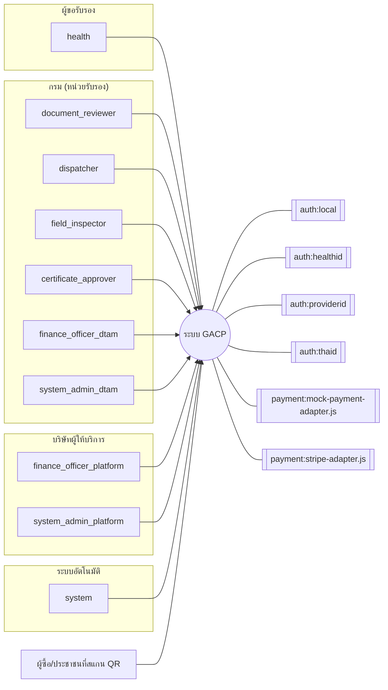

<!-- สร้างโดย scripts/docs/generate-architecture-diagrams.js ห้ามแก้ด้วยมือ -->

# แผนภาพบริบท (C4 ชั้นที่ 1)

```mermaid
flowchart LR
  subgraph aff_public["ผู้ขอรับรอง"]
    health["health"]
  end
  subgraph aff_certification_body["กรม (หน่วยรับรอง)"]
    document_reviewer["document_reviewer"]
    dispatcher["dispatcher"]
    field_inspector["field_inspector"]
    certificate_approver["certificate_approver"]
    finance_officer_dtam["finance_officer_dtam"]
    system_admin_dtam["system_admin_dtam"]
  end
  subgraph aff_platform_operator["บริษัทผู้ให้บริการ"]
    finance_officer_platform["finance_officer_platform"]
    system_admin_platform["system_admin_platform"]
  end
  subgraph aff_system["ระบบอัตโนมัติ"]
    system["system"]
  end
  public_scan["ผู้ซื้อ/ประชาชนที่สแกน QR"]
  gacp(("ระบบ GACP"))
  health --> gacp
  document_reviewer --> gacp
  dispatcher --> gacp
  field_inspector --> gacp
  certificate_approver --> gacp
  finance_officer_dtam --> gacp
  system_admin_dtam --> gacp
  finance_officer_platform --> gacp
  system_admin_platform --> gacp
  system --> gacp
  public_scan --> gacp
  auth_local[["auth:local"]]
  gacp --- auth_local
  auth_healthid[["auth:healthid"]]
  gacp --- auth_healthid
  auth_providerid[["auth:providerid"]]
  gacp --- auth_providerid
  auth_thaid[["auth:thaid"]]
  gacp --- auth_thaid
  payment_mock_payment_adapter_js[["payment:mock-payment-adapter.js"]]
  gacp --- payment_mock_payment_adapter_js
  payment_stripe_adapter_js[["payment:stripe-adapter.js"]]
  gacp --- payment_stripe_adapter_js
```
