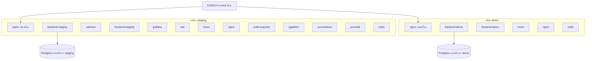

<!-- สร้างโดย scripts/docs/generate-architecture-diagrams.js ห้ามแก้ด้วยมือ -->

# แผนภาพการติดตั้ง

ที่มา: `evidence/architecture/hosts/*.txt` (บันทึกด้วย `scripts/docs/snapshot-hosts.sh`)

```mermaid
flowchart TB
  edge["CDN/ไฟร์วอลล์หน้าบ้าน"]
  subgraph staging_host["เครื่อง staging"]
    staging_hostnginx["nginx บนเครื่อง"]
    staging_backend_staging["backend-staging"]
    staging_cadvisor["cadvisor"]
    staging_frontend_staging["frontend-staging"]
    staging_grafana["grafana"]
    staging_loki["loki"]
    staging_minio["minio"]
    staging_nginx["nginx"]
    staging_node_exporter["node-exporter"]
    staging_pgadmin["pgadmin"]
    staging_prometheus["prometheus"]
    staging_promtail["promtail"]
    staging_redis["redis"]
  end
  edge --> staging_hostnginx
  staging_db[("Postgres แบบบริการ: staging")]
  staging_backend_staging --> staging_db
  subgraph demo_host["เครื่อง demo"]
    demo_hostnginx["nginx บนเครื่อง"]
    demo_backend_demo["backend-demo"]
    demo_frontend_demo["frontend-demo"]
    demo_minio["minio"]
    demo_nginx["nginx"]
    demo_redis["redis"]
  end
  edge --> demo_hostnginx
  demo_db[("Postgres แบบบริการ: demo")]
  demo_backend_demo --> demo_db
```
